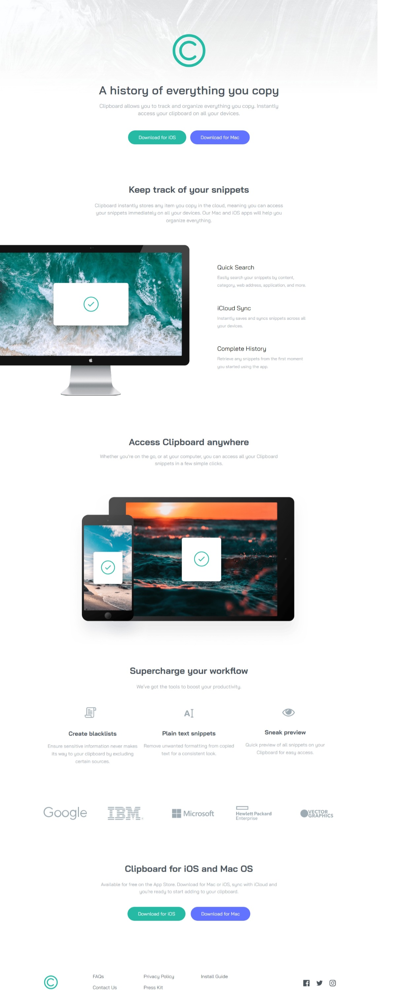

# FM-Clipboard-landing-page
Frontend Mentor | Clipboard landing page

# Frontend Mentor - Clipboard landing page solution

This is a solution to the [Clipboard landing page challenge on Frontend Mentor](https://www.frontendmentor.io/challenges/clipboard-landing-page-5cc9bccd6c4c91111378ecb9). Frontend Mentor challenges help you improve your coding skills by building realistic projects. 

## Table of contents

- [Overview](#overview)
  - [The challenge](#the-challenge)
  - [Screenshot](#screenshot)
  - [Links](#links)
- [My process](#my-process)
  - [Built with](#built-with)
  - [What I learned](#what-i-learned)
  - [Continued development](#continued-development)
- [Author](#author)

## Overview

### The challenge

Users should be able to:

- View the optimal layout for the site depending on their device's screen size
- See hover states for all interactive elements on the page

### Screenshot

<figure>
  
</figure>

### Links

- Solution URL: [gitHub](https://github.com/abdellah-abadou/FM-Clipboard-landing-page)
- Live Site URL: [Preview](https://front-mentor-clipboard-landing-page.netlify.app/)

## My process

It took me about six hours to complete the project. The desktop preview was easy, but as for the mobile preview, I did it in a hurry and did not pay attention to any detail. In the end, I can say that the code works, but I am sure that it is not the best.

### Built with

- Semantic HTML5 markup
- CSS custom properties
- Flexbox

### What I learned

I did not learn anything new, but I realized the importance of organizing work and classes

### Continued development

I want to improve the way I name classes and write clean code

## Author

- Frontend Mentor - [@abdellah-abadou](https://www.frontendmentor.io/profile/abdellah-abadou)

